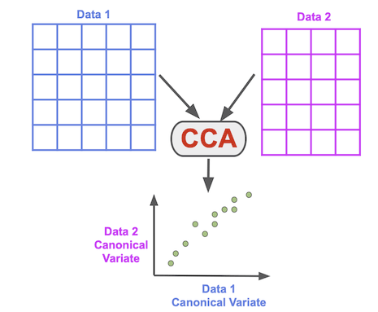

```{r startup, include=FALSE}
rm( list=ls() )
library( sf )
library( CCA )
library( knitr )
library( leaflet )
library( gstudio )
library( popgraph )
library( tidyverse )
library( kableExtra )

```


OK, there is a level of complexity in the data that we are foundering in.  I think we need to step back and take a slightly more complete view of what is going on and rely upon the things that we have access to.

Our goal here is to ask the following question:

> How does ecological context/urban position influence connectivity in an understory tree?

There are several facets of this and I think we can take them sequentially.  I'm going to use the complete data set as an example to walk through this but we'll want to do this for the rest of the data as well.  I'm using your data assuming that the file `Families_edited.csv` (dated last modified 9 June 2021) is the proper data file to work with.  Your GoogleDrive file is a bit messed up for reasons I cannot understand and it is not treating it as a CSV file (Excel cruft?).  I downloaded a local copy.

```{r}
df <- read_population( "data/Families_edited.csv", type="separated", locus.columns=7:15)
summary( df )
```

## Plot the Locations

First things first, lets get an idea of where these individuals are located.

```{r}
df %>% 
  filter( OffID == "0") %>%
  st_as_sf( coords=c("longitude","latitude"), crs=4326 ) -> moms

moms %>%
  leaflet() %>%
  addCircles( color="red") %>%
  addProviderTiles( provider = providers$Stamen.Terrain)

```

So now, we should look to see if there are features of the surrounding landscape that influence the diversity of pollen reaching a maternal tree.  


### Main Spatial Axis

Before I do this, I'm going to define a new variable representing the main spatial axis along which your data are arrayed.  Then we can look at how the varialbes we are looking at change sytematically along that axis.


```{r}
df %>%
  filter( OffID == "0") %>%
  select( longitude, latitude ) %>%
  princomp() -> pcfit

moms$MainAxis <- pcfit$scores[,1]
```

Now, we can look at pollen pool diversity using effective allelic diversity, make it a wide `data.frame`, and then merge in the maternal locations.

```{r}
pollen <- minus_mom( df )
pollen %>% 
  genetic_diversity(stratum="ID") %>%
  merge( moms %>% select(Stratum = ID, MainAxis, geometry) ) %>%
  select( Stratum, MainAxis, everything() ) %>%
  mutate( Locus = factor( Locus) ) -> df.pollenDiversity

head( df.pollenDiversity )
```

Now, we can plot the diversity as a function of axis location

```{r}
df.pollenDiversity %>%
  ggplot( ) + 
  geom_line( aes( MainAxis, Ae)) + 
  facet_grid(Locus ~ . )
```

So spatially, there seems to be lots of variation but not systematically arranged as a clear gradient. If we wanted to look at any one of the locus correlations as well as the sum of all `Ae` values, we can make this output.

```{r}
df.pollenDiversity %>%
  spread( Locus, Ae ) -> df 

df.table <- data.frame( Locus = names( df)[4:12],
                        Correlation = NA,
                        P = NA
)
for( locus in df.table$Locus ) {
  
  if( any(is.infinite(df[[locus]]))) {
    df[[locus]][is.infinite(df[[locus]])] <- NA
    
  }
  
  fit <- cor.test( df$MainAxis, 
                   df[[locus]], 
                   na.rm=TRUE)
  
  
  
  df.table$Correlation[ df.table$Locus == locus ] <- fit$estimate
  df.table$P[ df.table$Locus == locus ] <- fit$p.value
}

df.pollenDiversity %>%
  group_by( Stratum ) %>%
  summarize( MainAxis = mean( MainAxis),
             Diversity = sum( Ae )) %>%
  filter( !is.infinite(Diversity) ) -> df 

cor.test( df$MainAxis, df$Diversity, na.rm=TRUE) -> fit.all

rbind( df.table, data.frame( Locus = "Multilocus", 
                             Correlation = fit.all$estimate, 
                             P = fit.all$p.value )) %>%
  kable( caption = "Correlation of single locus estimates for effective allelic pollen pool diversity along main spatial axis.",
         digits = 4,
         row.names = FALSE) %>%
  kable_paper() %>%
  kable_styling( full_width = FALSE)

```

OK, so no overall systematic change in observed diversity at a locus 'spatially' along the main axis of sampling.  This is probably something that is not that surprising, since the gradient in urbanness is probalby not aligned perfectly with the main spatial axis.

### At Site Diversity - The Reesponses

So, now let's look at the various things we've measured `at` a specific location.  I'm going to do this in a multivariate context to see not only if there are any specific things that are individually correlated but also if there  are linear combinations of features that 

First, I'll take the pollen polls and reduce them to a single vector based upon allele frequencies and then do a simple rotation to project it into a lower dimensional space.

```{r}
pollen %>%
  to_mv() %>% 
  princomp( cor=TRUE ) -> fit.pca 
```

Let's take a look at the loadings for each axis we see that we have 142 independently assorting alleles in this data set (across all loci).

```{r}
summary( fit.pca )
```
Each individual rotated axis explains an incrementally smaller amount of variation (though we probably could get away with much less thatn 142 predictors overall).

```{r}
plot( fit.pca )
```

So it looks like there is a smooth transition in pollen pool structure across the rotated axes.  If we plot the moms in this new space, we see the following

```{r, warning=FALSE}
predict( fit.pca ) %>%
  data.frame() %>%
  mutate( Stratum = pollen$ID ) -> df.pca

df.pca %>%
  ggplot( aes(Comp.1,Comp.2, color=Stratum) ) + 
  geom_point( show_legend=FALSE) + 
  theme_minimal() +
  scale_color_discrete( guide=FALSE)
```

Besides one outlier there does not seem to be any major issues.  Just to ignore that one.

```{r}
df.pca %>%
  ggplot( aes(Comp.1,Comp.2, color=Stratum) ) + 
  geom_point( show_legend=FALSE) + 
  theme_minimal() +
  scale_color_discrete( guide=FALSE) + 
  ylim( c(10,-10))
```


We can also reduce the dimensionality of the entire thing and look at it as a principal coordinates analysis (same data, just summarized at the level of the mom rahter than the individual)

```{r}
pollen %>%
  frequency_matrix(stratum = "ID") -> freqs
f <- as.matrix( freqs[ , c(2:ncol(freqs))])
rownames( f ) <- freqs$Stratum 
fit.pcoa <- prcomp( f, center = TRUE )
summary( fit.pcoa )
```

Then look at where individual mothers come out.

```{r}
predict( fit.pcoa ) %>%
  data.frame() %>%
  mutate( Stratum = freqs$Stratum ) %>%
  ggplot( aes(PC1,PC2) ) + 
  geom_text( aes(label=Stratum)) + 
  theme_minimal() 
```

To see what is loading on these axes we can use the `fviz_pca` function.

```{r}
library( factoextra )
fviz_pca_var( fit.pcoa )
```


So it looks like:

1. As a group of individuals, there are no obvious clustering (e.g., we have a single mixing population of samples).  
2. As mothers, there are a few outer groups but in general there seems to be a good description of the genetic structure in either an *individual* based analysis of as *moms*.

This is good as it suggests that there is no reason we cannot use these rotated axes of pollen pool structure to see if they have a relationship with sets of at-site variables.


### At Site Diversity - Predictors

So now let's grab all the predictor varialbes for `at-site` variablilty and see if there is anything intersting going on there.  For this one, I'm using the data from the files `DF5_mom.csv`, `DF10_mom.csv`, and `DF50_mom.csv` and doing some tricky stuff 

```{r}
loadAndFixNames <- function( file, size ) { 
  read_csv( file, show_col_types = FALSE ) -> df
  df %>%
    gather( names(df)[2:ncol(df)], key = Feature, value = Value) %>%
    mutate( Feature = paste( Feature, size,sep=".")) %>%
    spread( Feature, Value )  
}

loadAndFixNames(  "data/DF5m_mom.csv", 5 ) %>%
  merge( loadAndFixNames(  "data/DF10m_mom.csv", 10 ) ) %>% 
  merge( loadAndFixNames(  "data/DF50m_mom.csv", 50 ) ) %>%
  mutate( Stratum = factor( mom ) ) %>%
  select( -mom, -total.5, -total.10, -total.50 ) %>%
  select( sort(names(.)) ) %>% 
  select( Stratum, everything() ) -> df.atsite 

summary( df.atsite)
```

Let's drop the columns that have no variation.  We also have to pull out any columns with missing data (cannot invert via SVD with NA, Inf, or NaN).  I opted to drop the columns rather then remove the trees since most of the missing data is from mom tree characteristics, not things that are around her.

```{r}
df.atsite %>%
  select( -water.10, -water.5, 
          -pasture.5, -pasture.10, -pasture.50,
          -disturbed.5, -disturbed.10, -disturbed.50, 
          -other.5, -other.10, 
          -shrub.5, -shrub.10, -shrub.50,
          -height_m.5, -height_m.10, -height_m.50,
          -total_basal_area_sqcm.5, -total_basal_area_sqcm.10, -total_basal_area_sqcm.50) -> df

summary( df )
```

Now, lets look at the PC scores for the frist two dimenstions of the ecological data.

```{r}
raw <- as.matrix( df[,2:ncol(df)] )
rownames( raw ) <- df$Stratum
pcfit.atsite <- princomp( raw, cor=TRUE )
fviz_pca_ind( pcfit.atsite )
```

So, this is not an uncommon U-shaped patter we typically see.  Most of hte PWP stuff seems clustered on one side.  OK.

Let's see what is loading on this separation.  

```{r}
fviz_pca_var( pcfit.atsite )
```

Not too surprsing.


### Putting it All Together
 
 So at this point, it makes sense that we may want to put these two things together.  I was thinking of using a canonical correlation, which takes rotation on two data sets and looks for linear combinations that maximize the correlation between the two.
 
<center>

</center>

First, we must make sure that the order of the mothers is the same in both frequency and environmental data.
 
```{r}
X <- freqs[,2:ncol(freqs)]
Y <- df.atsite[, 2:ncol(df.atsite)]
fit <- cancor(Y,X)

```
 
 
 
 