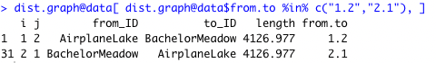

This notebook is designed to help in setting up what I call a "GraphedLandscape", e.g., one in which we overlay topologies onto so that we can examine if intervening (between site) or localized (at site) variables are contributing to the observed distribution of genetic variation we see as represented as a Population Graph.

```{r setup, include=FALSE}
knitr::opts_chunk$set( echo = TRUE )
library( igraph )
library( gstudio )
library( popgraph  )
library( tidyverse )
```

The data I'm going to use for this is the `scaled_rural` data set from the dogwood gradient project.  I'm going to clean it up a bit, though I will assume that cGD is present and represents the only edges in the topology.

```{r}
suppressMessages( read_csv( "../data/rural.csv" )) %>%
  select(FROM, TO, cGD, Euclidean = DISTft,
         everything() ) -> raw_data
raw_data <- raw_data[,-(5:13)]
```

First, I'm going to make a popgraph from this just so I can look at it.  I am assuming that there are no isolated nodes (though they'd be irrelevant to the analysis anyways because there is nothing `between` them to examine).

```{r}
nodes <- sort( unique( c( raw_data$FROM, raw_data$TO ) ))
A <- matrix( 0, nrow = length( nodes ), ncol = length( nodes ) )
rownames(A) <- colnames(A) <- nodes 

for( i in seq(1,nrow(raw_data )) ){ 
  idx1 <- which( nodes == raw_data$FROM[i] )
  idx2 <- which( nodes == raw_data$TO[i] )
  
  # assigned for both above and below diagonal (symnmetric)
  A[idx2, idx1] <- A[idx1,idx2] <- raw_data$cGD[i]
}

graph <- graph_from_adjacency_matrix( A, mode="undirected", weighted=TRUE)
numNodes <- length( igraph::V(graph) )
numEdges <- length( igraph::E(graph) )
plot( graph )
```

OK, so of the `r numNodes` mother trees with `r numEdges` edges

In looking at the data that is found in the Gravity Laboratory examples, there does seem to be a divergence between what was presented there and the data you've shown me from your own data.  Your intuitions are correct, there should not be a case where there are a different number of observations for moms in the `FROM` and `TO` columns.  In particular, I noticed:  

1. The example data set, there are 31 sites and they are starting out with a saturated graph (and I may have to point out that I really hate the coding style Jeffrey and Melanie use...).

2. On this data set, there are 31 sites and the whole thing has 31 * 30 = `r 30 * 31` rows.  If you take the data set and sort it by FROM, there are 30 rows for each site with all the connections (think a view of connections FROM a particular site).  And if you sort from TO, there are exactly 30 rows for each connection as well.  So if there are 30 edges from a node as FROM, there are 30 edges from a node if it acts as TO.  

3. This means that the FROM and TO columns are identical in nature **but** one is just sorted by FROM and the other is sorted as TO.  Here are the rows in the `data.frame` for the first two locations showing that the individual value estimated for `length` is represented twice.

<center></center>

&nbsp;

4. This means for us that each edge should be represented in both directions, meaning that while we have `r length(E(graph))` as *bidirectional*, we'll need to have have `r numEdges * 2` rows to have both direction represented.

```{r}
raw_data %>%
  mutate( from.to = paste( FROM, TO, sep="-" )) -> df_forward 

raw_data %>%
  mutate( from.to = paste( TO, FROM, sep="-" )) -> df_reverse

df <- rbind( df_forward, df_reverse)
```

5. So if we look at this now, we can see that we have a pair of rows for each edge in the system.

```{r}
df[ df$from.to %in% c("361PWP-358PWP", "358PWP-361PWP"),]
```

## Setting Up a Stepwise Approach

So as a first pass, let's step through an analysis using the more traditional step-wise approach using a simple correlation of unexplained variation approach.  In essence, I will:

1. Find the variable that is most highly correlated with the raw data.
2. Fit the new model containing these data.
3. Extract various qualitative values from the data (AIC, R^2, P)
4. Determine the residuals
5. Identify the remaining variable that is most correlated with the residuals.
6. GoTo #2 until such time that AIC stops going down and things start going up.

For this, I have a simple gravity function that does the analysis and spits back some output.


```{r}
gravity <- function(y, x, group, data, ln=TRUE, constrained=TRUE) {
  if (!require(nlme)) stop("nlme PACKAGE MISSING")
  if (!require(lattice)) stop("lattice PACKAGE MISSING")
  gdata <- data[,c(group,y,x)] 

  if(ln==TRUE) { 
    gdata[,x] <- log(abs(gdata[,x]))
    gdata[,y] <- log(abs(gdata[,y]))
    gdata[gdata == -Inf] <- 0 
    gdata[gdata == Inf] <- 0  		
  } 		   		
  fmla <- as.formula(paste(paste(y, "~", sep="") , paste(x, collapse= "+")))       
  if (constrained == FALSE) { 
    print("Running unconstrained model, defaulting to OLS. Please check assumptions")
    gvlmm <- lm(fmla, data=gdata)
    gvaic <- AIC(gvlmm)
    return( list(formula=fmla, GravityModel=gvlmm, Summary=summary(gvlmm), 
                 AIC=gvaic, x=gdata[,x], y=gdata[,y]) )  	  	  
  } else {
    gvlmm <- lme(fmla, random = ~1 | group, data=gdata)
    gvaic <- AIC(gvlmm)
    return( list(formula=fmla, GravityModel=gvlmm, Summary=summary(gvlmm), 
                 AIC=gvaic, x=gdata[,x], y=gdata[,y], groups=gdata[,group]) )  	  
  }
}	
```


And here are some helper functions that will aid in saving features of the models we get. There is one tricky bit of work that we need to do regarding dropping the values that may be considered going forward.  As a simple heuristic, once we identify feature `X` as being informative for its particiualr combination of either radial distance (for at-site features) or all the other levels for between-site features (movement model, pixel size, etc.), we need a way to easily make the rest unavailable.  I'm going to create a simple function that returns the related column names based upon the one that is fit.  It is a bit wonky and relies completely upon your existing naming convention, but as long as you are consistent, it should work.

```{r}
lme.sum <- function(mod){
  res <- data.frame(
    "Beta" = summary(mod)$coefficients$fixed,
    "Lower.CI" = summary(mod)$coefficients$fixed - 1.96*sqrt(diag(mod$varFix)),
    "Upper.CI" = summary(mod)$coefficients$fixed + 1.96*sqrt(diag(mod$varFix)),
    "P.value" = 2 * pt(-abs(summary(mod)$coefficients$fixed/sqrt(diag(mod$varFix))), 
                             summary(mod)$fixDF[[1]])
  )
  return(res)
}

find.r2 <- function( lme.object ){
  yhat <- predict( lme.object )
  obs <- lme.object$data$cGD
  f <- lm( obs ~ yhat )
  summary(f)$adj
}

get_formula <- function( lme.object ) { 
  return(Reduce( paste, deparse( lme.object  )) )
}

colsToDrop <- function( toDrop, theNames ) {
  prefix <- paste( str_split_fixed(toDrop, "_", 3)[1,1:2], collapse ="_")
  groupToDrop <- theNames[ str_sub( theNames, 1, str_length(prefix))  == prefix ]
  if( length(groupToDrop) == 0  ) {
    groupToDrop <- toDrop
  }
  return( groupToDrop )
}

```

Now let's run through the data.  

```{r}
# drop the non numeric and missing daa 

df %>% select( -c(FROM, TO, from.to, as_grass_5_F, as_grass_10_F, as_height_F, as_basal_area_F) ) -> data

group <- as.factor( df$FROM )

```

I'm going to step through this manually to get things going.

```{r}

correlations <- cov2cor(var( data, na.rm=TRUE))[1,2:ncol(data)]
idx <- which( abs( correlations ) == max( abs(correlations), na.rm=TRUE))
predictors <- names(idx)

# drop the
for( col in colsToDrop( predictors, names(data )) ) {
  data[[col]] <- NULL
}
fit <- gravity( y="cGD", x = predictors, group="FROM", data=df )

models <- fit 
output <- data.frame( model = get_formula( fit$formula ),
                      AIC = fit$AIC, 
                      BIC = summary( fit$GravityModel )$BIC,
                      R2 = find.r2(fit$GravityModel ) ) 
output
```

Now, one at a time, I am going to walk through the remaining data columns and do the same thing by finding residuals, identifying the most highly correlated value with them, fitting a model and adding it to the output table.

```{r}

data$cGD <- residuals( fit$GravityModel )
correlations <- cov2cor(var( data, na.rm=TRUE))[1,2:ncol(data)]
idx <- which( abs( correlations ) == max( abs(correlations), na.rm=TRUE))
nextVar <- names(data)[idx]
predictors <- c( predictors, nextVar )
for( col in colsToDrop( nextVar, names(data )) ) {
  data[[col]] <- NULL
}
fit <- gravity( y="cGD", x = predictors, group="FROM", data=df )
output <- rbind( output,
                 data.frame(model = get_formula( fit$formula ),
                            AIC = fit$AIC, 
                            BIC = summary( fit$GravityModel )$BIC,
                            R2 = find.r2(fit$GravityModel ) 
                            )
                 )
output
```


